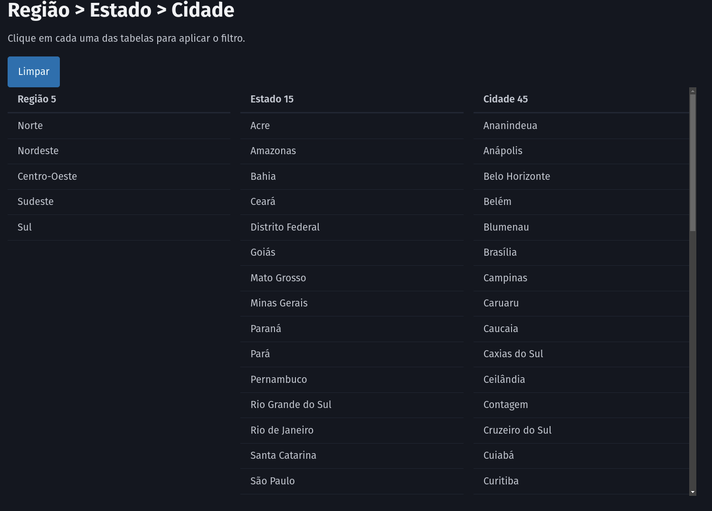

# API regional

Esta app faz filtros simultâneos.

* Se clicar em Região filtra os Estados e Cidades.
* Se clicar em Estado filtra a Região e as Cidades.
* Se clicar em Cidade filtra o Estado e a Região.




## Este projeto foi feito com:

* [Python 3.11](https://www.python.org/)
* [Django 5.0.4](https://www.djangoproject.com/)
* [Django-Ninja 1.1.0](https://django-ninja.rest-framework.com/)
* [PicoCSS](https://picocss.com/)
* [AlpineJS](https://alpinejs.dev/)


## Como rodar o projeto?

* Clone esse repositório.
* Crie um virtualenv com Poetry
* Ative o virtualenv.
* Instale as dependências.
* Rode as migrações.

```
git clone git@github.com:djwesleyborges/regioes-vs-estados-vs-cidades.git
cd regioes-vs-estados-vs-cidades
poetry shell
poetry install
python contrib/env_gen.py
python manage.py migrate
python manage.py createsuperuser --email="admin@admin.org"
```

Acesse: http://localhost:8000/api/v1/docs

## Criando dados

Rode o comando a seguir para popular o banco.

```
python manage.py create_data
```
